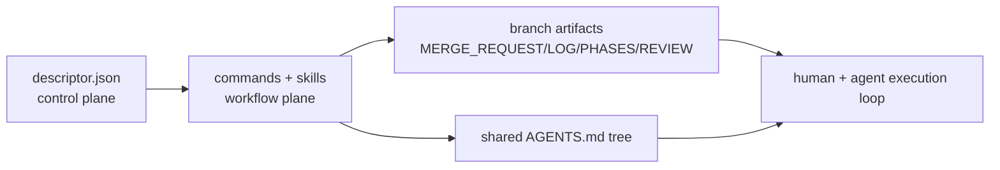

OpenCode Conductor has three layers: control plane (`descriptor.json`), workflow plane (commands + skills), and data plane (branch artifacts + shared knowledge).

```mermaid
flowchart LR
  D[descriptor.json<br/>control plane] --> C[commands + skills<br/>workflow plane]
  C --> A[branch artifacts<br/>MERGE_REQUEST/LOG/PHASES/REVIEW]
  C --> K[shared AGENTS.md tree]
  A --> R[human + agent execution loop]
  K --> R
```
