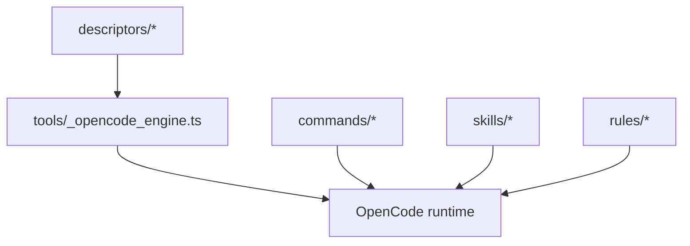

Core components and responsibilities:

- `descriptors/` defines schema and examples.
- `tools/_opencode_engine.ts` resolves descriptor-driven paths and refresh/bootstrap behavior.
- `commands/` orchestrates operational workflows.
- `skills/` provides on-demand lenses.
- `rules/` sets always-on guardrails.

