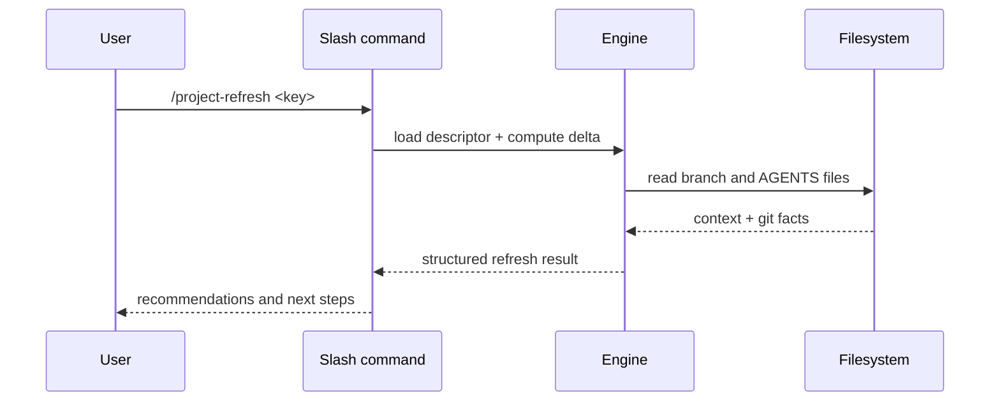

The primary data flow starts with a command invocation, resolves descriptor paths, and updates artifacts or suggestions.

```mermaid
sequenceDiagram
  participant U as User
  participant Cmd as Slash command
  participant Eng as Engine
  participant FS as Filesystem

  U->>Cmd: /project-refresh <key>
  Cmd->>Eng: load descriptor + compute delta
  Eng->>FS: read branch and AGENTS files
  FS-->>Eng: context + git facts
  Eng-->>Cmd: structured refresh result
  Cmd-->>U: recommendations and next steps
```
