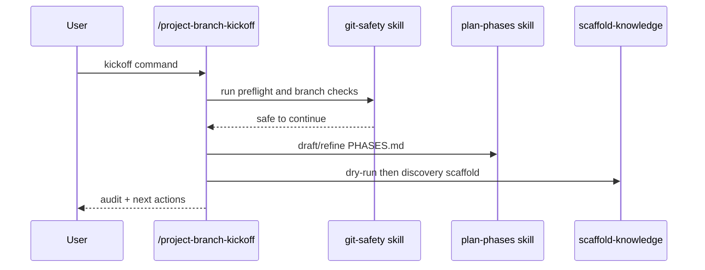

Branch kickoff sequence ties together git safety, planning, and knowledge discovery.

```mermaid
sequenceDiagram
  participant U as User
  participant K as /project-branch-kickoff
  participant G as git-safety skill
  participant P as plan-phases skill
  participant S as scaffold-knowledge

  U->>K: kickoff command
  K->>G: run preflight and branch checks
  G-->>K: safe to continue
  K->>P: draft/refine PHASES.md
  K->>S: dry-run then discovery scaffold
  K-->>U: audit + next actions
```
