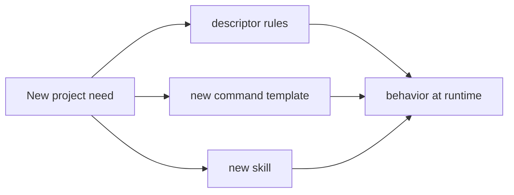

The design is extension-first: add command templates, skill guides, and descriptor rules without changing the core engine.

```mermaid
flowchart LR
  X[New project need] --> D[descriptor rules]
  X --> C[new command template]
  X --> S[new skill]
  D --> B[behavior at runtime]
  C --> B
  S --> B
```
