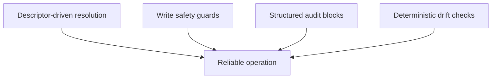

Key invariants:

- Descriptor-driven paths are source of truth.
- Root containment and symlink refusal protect writes.
- Audit-trail sections remain structured and prompt-safe.
- Knowledge preflight is deterministic and git-based.

