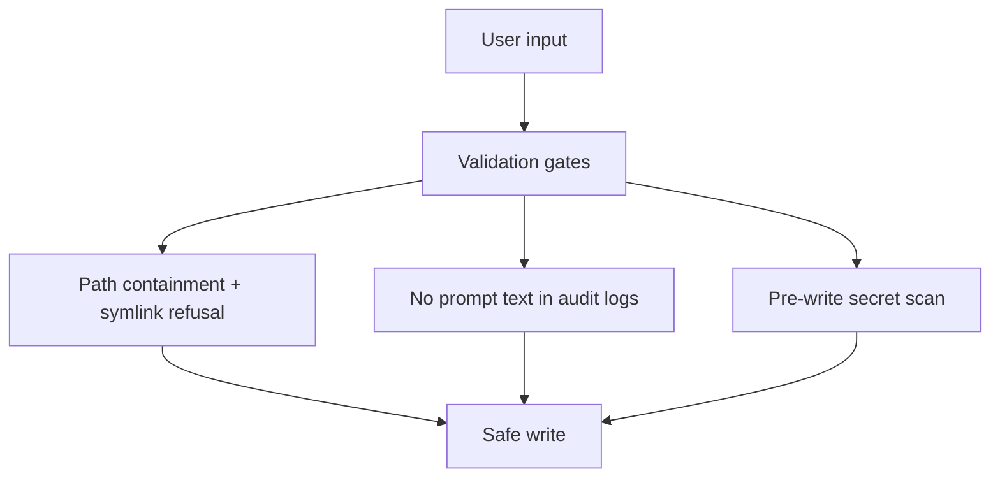

Security controls are implemented as command constraints and policy docs, not only post-hoc review.

```mermaid
flowchart TD
  U[User input] --> V[Validation gates]
  V --> P[Path containment + symlink refusal]
  V --> T[No prompt text in audit logs]
  V --> S[Pre-write secret scan]
  P --> O[Safe write]
  T --> O
  S --> O
```

See also `SECURITY.md` and `docs/PATH_CONTRACT.md`.
