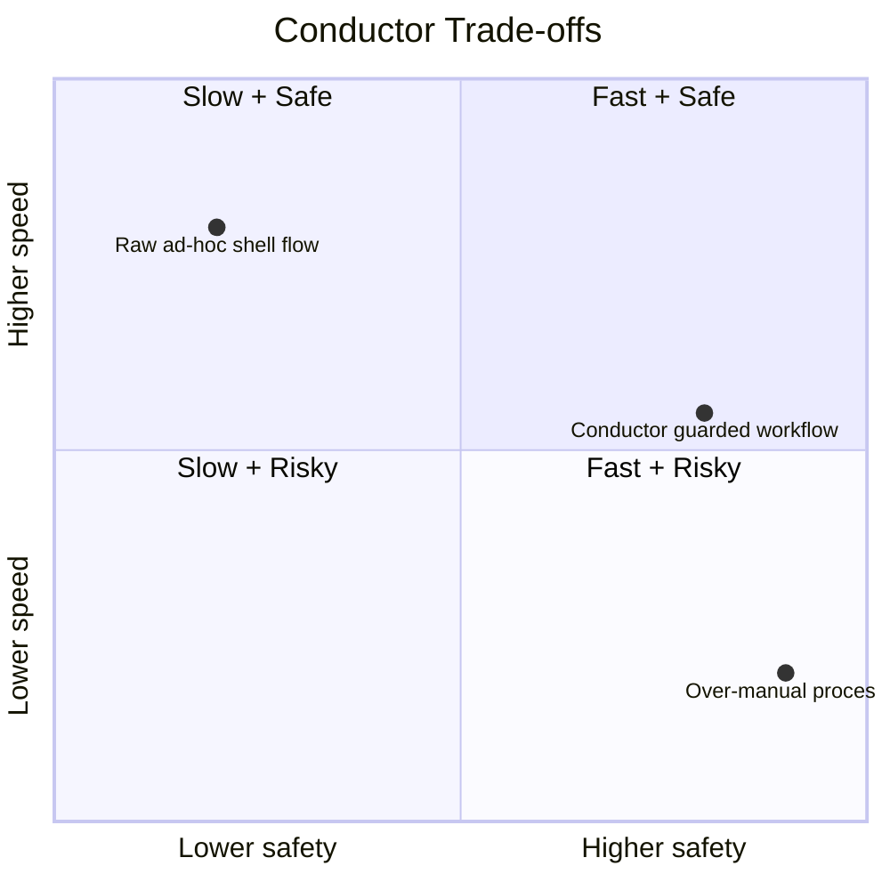

Primary trade-offs are explicit and documented:

- More structure in exchange for reproducibility.
- Small always-on rule cost in exchange for higher first-pass quality.
- Safety confirmations in exchange for slower destructive git paths.

