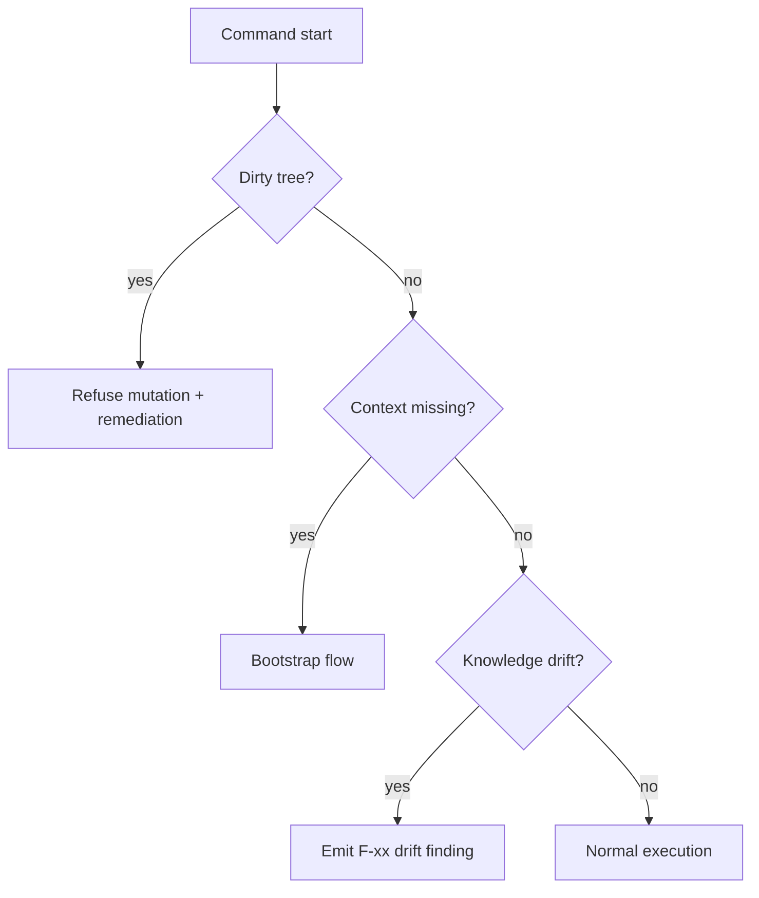

Typical failure modes and how the kit responds:

- Dirty tree before branch mutation -> refuse and ask for explicit stash/commit.
- Missing branch context -> bootstrap recommendation.
- Missing AGENTS files -> scaffold during knowledge-aware review preflight.
- Knowledge drift vs base -> deterministic finding and rebase guidance.

