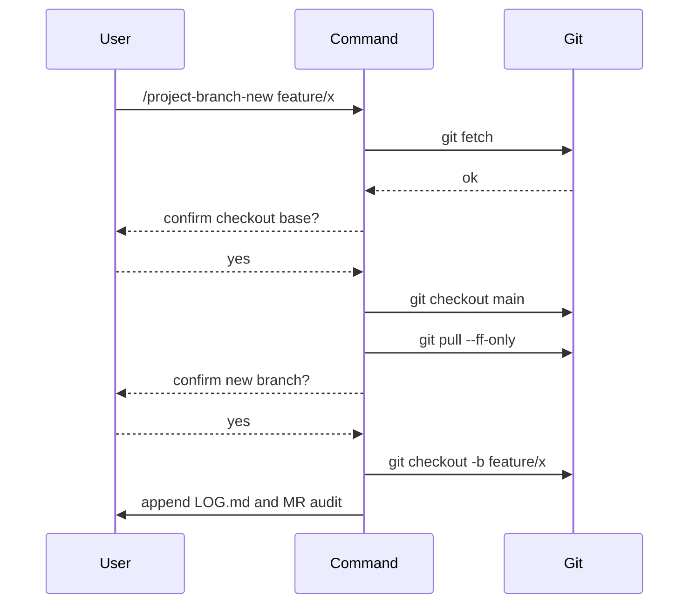
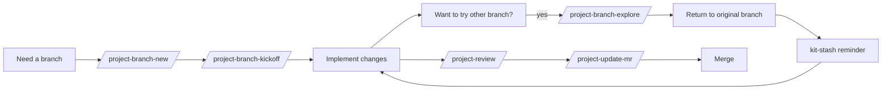

# Branch Lifecycle

Commands that own the lifecycle of a working branch from creation to exploration to state inspection.

## `/project-branch-new [<branch>]`

- **Purpose**: create a new branch with an explicit, audited git flow.
- **Frontmatter defaults**: `agent: build`, `subtask: false` (primary-context audit).
- **Arguments**: `$1` optional branch name; if omitted, command prompts for one.

### Per-step guard rails



### Worked example

```text
/project-branch-new feature/improve-cache

## Branch new result
- created: feature/improve-cache
- base: main (origin/main fast-forwarded)
- audit: LOG.md ### Branch new appended; MR ## OpenCode: refreshed
```

### When to use

- Starting a fresh feature, fix, or experiment branch.

### When not to use

- You already have a branch and just want kickoff to seed knowledge — use `/project-branch-kickoff`.

## `/project-branch-kickoff [<projectKey>]`

- **Purpose**: orchestrate bootstrap-or-refresh, plan-phases, and scaffold-knowledge in one auditable run.
- **Frontmatter defaults**: `agent: plan`, `subtask: false`.
- **Arguments**: `$1` optional project key; falls back to descriptor lookup.

### Behavior

1. Refuses on `main`/`master`.
2. Prompts for model.
3. Runs knowledge-drift preflight (silent-on by default).
4. Runs bootstrap or refresh as appropriate.
5. Drafts `PHASES.md` via `plan-phases` skill (mermaid prompt when phases > 3).
6. Runs `/scaffold-knowledge dry-run` then on approval applies it.
7. Appends comprehensive audit to `LOG.md` and MR.

### Worked example

```text
/project-branch-kickoff my-app

## Branch kickoff result
- model: <selected>
- bootstrapped: yes
- phases: 5 (mermaid prompt: yes)
- scaffold: 3 leaves created, 1 skipped (source missing)
- audit: LOG.md ### Branch kickoff appended
```

## `/project-branch-explore [<branch>]`

- **Purpose**: produce an `EXPLORE_GUIDE.md` for trying a feature branch in the browser, without browser automation.
- **Frontmatter defaults**: `agent: plan`, `subtask: true`.
- **Arguments**: `$1` optional branch.

### Output shape

```markdown
# Explore guide for <branch>

## Setup
- bun install (if package-lock changed)
- env vars to set

## What's new
- summary of diff

## How to try it
- URL: <localhost or domain>
- Steps: click X then Y, observe Z

## Caveats
- known issues
```

### Worked example

```text
/project-branch-explore feature/new-cards

## Explore guide written
- branch: feature/new-cards
- file: <path>/EXPLORE_GUIDE.md
- url: http://localhost:3000/cards/new
- setup: bun install (lockfile changed)
```

## `/project-state`

- **Purpose**: read-only sectioned snapshot of git state, descriptor presence, kit-stash entries, drift, and recent audit.
- **Frontmatter defaults**: `agent: plan`, `subtask: true`.

Use `/project-state` whenever you want a no-write status check.

## Mermaid: lifecycle at a glance


