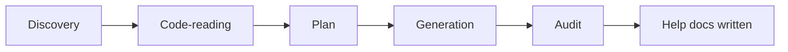

# Help Docs

`/project-help-docs` generates end-user help-center documentation from code via a five-phase workflow with safety guards.

## Quick reference

- **Frontmatter defaults**: `agent: plan`, `subtask: true`.
- **Required positional**: `<output-root>` — the absolute path where docs are written.
- **Refused by default**: writes inside the source repo. Pass `--allow-in-repo` to override.

## Arguments

| Flag | Purpose |
| --- | --- |
| `--scope=<area>` | Repeatable. Restrict generation to a feature area. |
| `--audience=<role>` | Repeatable. Tag pages with audience metadata. |
| `--brand=<name>` | Override brand name in generated content. |
| `--ban-term=<term>` | Repeatable. Adds to vocabulary ban-list. |
| `--no-frontmatter` | Skip page frontmatter generation. |
| `--no-mermaid` | Skip mermaid diagrams. |
| `--no-vocab-grep` | Skip post-write vocabulary audit. |
| `--allow-in-repo` | Allow writes inside the current repo. |

## Five-phase workflow



- **Discovery** — locate features, scopes, and target audience set; produce a per-feature plan.
- **Code-reading** — extract behavior, defaults, edge cases, error states from code.
- **Plan** — page outline with audience tags and cross-links.
- **Generation** — write pages with frontmatter, mermaid, examples.
- **Audit** — vocab ban-list grep; secret scan; output containment check.

## Worked example

```text
/project-help-docs ~/tmp/help-docs --scope=onboarding --audience=admin --brand=ACME

## Help docs generation result
- output_root: ~/tmp/help-docs
- scopes: onboarding
- audiences: admin
- files_written: 7
- frontmatter: enabled
- mermaid: enabled
- vocab_grep: enabled
- findings: none
- next_step: review and publish
```

## Safety stance

- Output containment is enforced: writes outside `<output-root>` are refused.
- In-repo writes are refused unless explicitly opted in.
- Vocabulary ban-list catches forbidden terms post-generation.
- Secret scan runs over generated content.

For the full skill specification, see [skills/help-docs-author](../skills/help-docs-author.md).
