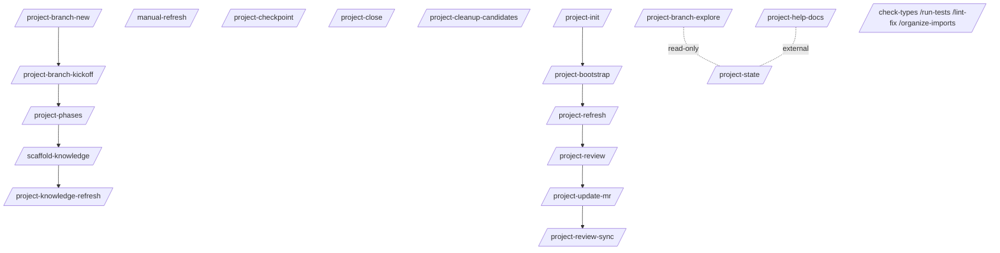

# Commands

This page is the full catalog of slash commands shipped with the kit. For each command we list:

- **Purpose** — one sentence
- **Frontmatter defaults** — `agent`, `subtask`, `model`
- **Arguments** — positional `$1`, `$2`, … and opt-out flags
- **Output** — structured markdown block shape
- **When to use** vs. **when not to use**
- **Worked example** — sample invocation and expected response

The contract version of this catalog lives at `documentation/COMMAND_WORKFLOW.md`.

## At a glance

## Command families

Use this as the navigation index — each family has its own sub-page below.

| Family | Pages |
| --- | --- |
| Init / refresh | [init-and-refresh](./init-and-refresh.md) |
| Branch lifecycle | [branch-lifecycle](./branch-lifecycle.md) |
| Knowledge maintenance | [knowledge-maintenance](./knowledge-maintenance.md) |
| Review and MR | [review-and-mr](./review-and-mr.md) |
| Help docs | [help-docs](./help-docs.md) |
| Verification helpers | [verification](./verification.md) |
| Reference map | [reference](./reference.md) |

## Conventions across all commands

- **Frontmatter** — see `documentation/PATH_CONTRACT.md` § Frontmatter conventions for the canonical table.
- **Audit trail** — mutating commands append `### <Activity>` to `LOG.md` and refresh `## OpenCode:` in the MR.
- **Pre-write secret scan** — durable knowledge writes run a regex pass for high-entropy or token-shaped strings.
- **No raw user prompts in audit** — `LOG.md` and MR machine blocks are summary blocks, not transcript dumps.
- **Opt-out flags** — knowledge-drift preflight, mermaid prompts, and source-path guards each have explicit opt-out flags so commands can run cleanly in batch / CI.
