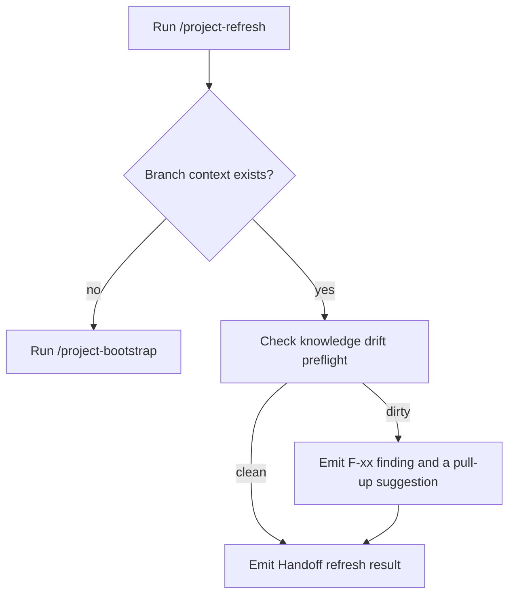

# Init and Refresh

Commands that bring a project under conductor management and keep agent context current.

## `/project-init <projectKey>`

- **Purpose**: scan a repo, draft `descriptor.json`, seed templates and `AGENTS.md`.
- **Frontmatter defaults**: `agent: plan`, `subtask: true`.
- **Arguments**: `$1` is the project key (used for state directory naming).
- **Output**: structured proposal block, then on-approval write log.

### When to use

- First-time setup of a new repo under the kit.
- When you want to regenerate the descriptor scaffold.

### When not to use

- The descriptor already exists and you only want to refresh runtime state — use `/project-refresh` instead.

### Worked example

```text
/project-init my-app

## Project init proposal
- projectKey: my-app
- projectRootPath: ~/projects/my-app
- opencodeProjectRootPath: ~/.config/opencode/projects/my-app
- areas: frontend, api
- writes: descriptor.json, _templates/mr/, AGENTS.md (project, area)
- safety: containment-checked, secret scan clean
```

## `/project-refresh <projectKey>`

- **Purpose**: refresh branch handoff state and surface drift.
- **Frontmatter defaults**: `agent: plan`, `subtask: true`.
- **Arguments**: `$1` is the project key.
- **Output**: `## Handoff refresh result` structured block.

### When to use

- Start of a session on an existing branch.
- After pulling new commits.

### When not to use

- The branch context does not exist yet — bootstrap first.

### Worked example

```text
/project-refresh my-app

## Handoff refresh result
- branch: feature/x
- mode: tracked
- mr_path: <path>
- log_path: <path>
- drift: none
- next_step: continue work or run /project-review
```

## `/manual-refresh <projectKey>`

- **Purpose**: tool-free refresh path that uses the same shape as `/project-refresh` but does not invoke any tools.
- **When to use**: tool-restricted environments or for explicit human review of state derivation.

## Mermaid: refresh decision flow


