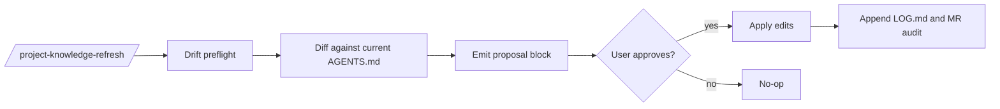
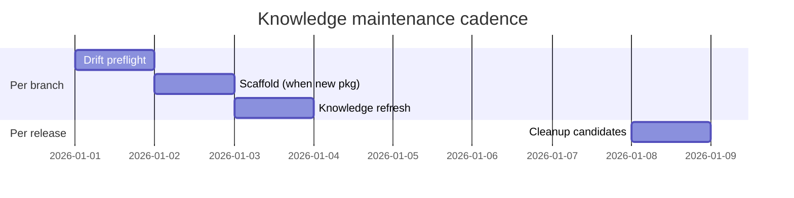

# Knowledge Maintenance

Commands that create, refresh, and curate durable knowledge across the project.

## `/scaffold-knowledge <projectKey> [list|dry-run]`

- **Purpose**: create or preview convention-path `AGENTS.md` files.
- **Frontmatter defaults**: `agent: plan`, `subtask: true`.

### Modes

- (default) — apply mode; writes new `AGENTS.md` files for areas/leaves not yet present.
- `list` — read-only enumeration.
- `dry-run` — preview proposed paths and contents without writing.

### Safety guards

- `invalid_package_name`
- `symlink_refused`
- `path_outside_root`
- `source_missing` (with `no-source-guard` opt-out)

### Worked example

```text
/scaffold-knowledge my-app dry-run

## Scaffold dry-run
- targets: <n>
- skipped: 1 (source_missing: api/v3/legacy)
- preview: <inline tree>
- next_step: rerun without dry-run to apply
```

## `/project-knowledge-refresh <projectKey>`

- **Purpose**: proposal-first knowledge refresh; emits proposed edits before mutating.
- **Frontmatter defaults**: `agent: plan`, `subtask: true`.

### Workflow



### Worked example

```text
/project-knowledge-refresh my-app

## Knowledge refresh proposal
- area: frontend
- leaves to update: 2
- new sections: ## Verification scripts (frontend)
- drift: F-12 stale frontend AGENTS.md vs origin/main
```

## `/project-cleanup-candidates <projectKey>`

- **Purpose**: read-only report of candidate stale folders/files.
- **When to use**: after large refactors, when leaf paths might no longer reflect source.

## Recommended cadence



## How knowledge feeds review

The structured-knowledge tables you maintain here drive `/project-review`'s deterministic verification suggestions — see [review-and-mr](./review-and-mr.md).
