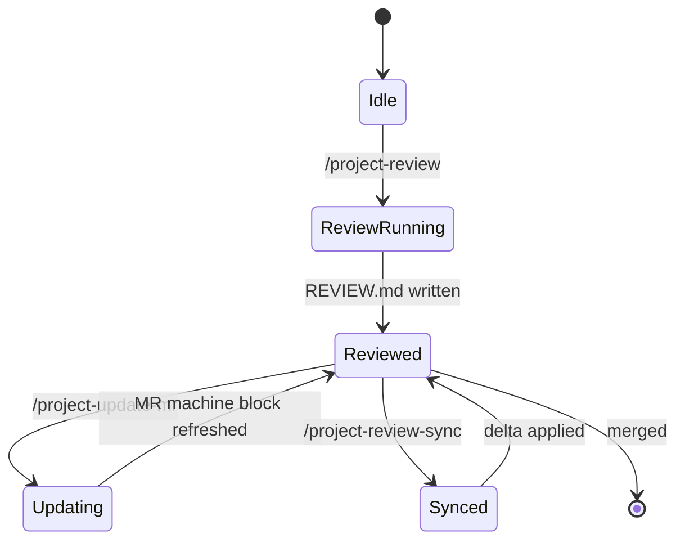

# Review and MR

Commands that produce review artifacts, refresh the merge-request, and keep deltas in sync.

## `/project-review <projectKey>`

- **Purpose**: run a structured review pass and produce `REVIEW.md` plus deterministic verification suggestions derived from area `## Verification scripts` tables.
- **Frontmatter defaults**: `agent: plan`, `subtask: true`.

### Output sections

- `## Preflight summary` — drift findings, missing-block findings (`F-xx`).
- `## Findings` — table of issues with severity, scope, suggested fix.
- `## Suggested verifications` — derived from structured-knowledge tables.
- `## Mermaid` (opt-in) — review-flow or impact diagrams.

### Worked example

```text
/project-review my-app

## Preflight summary
- drift: clean
- missing-block: F-21 frontend AGENTS.md lacks ## Verification scripts

## Findings
| id | severity | scope | summary |
| --- | --- | --- | --- |
| F-01 | warn | frontend/cards | dead branch in CardList |
| F-02 | info | api/handlers | unused import |

## Suggested verifications
- bun run typecheck (frontend)
- bun run test (frontend)
- pytest api/handlers/tests.py -v (api)
```

### Mermaid prompt

The review command prompts you whether to add a `## Mermaid` section. The default is opt-in to keep review docs lean.

## `/project-review-sync <projectKey>`

- **Purpose**: merge-only update of `REVIEW.md` and MR `OpenCode:` blocks against the latest diff.
- **When to use**: after pushing additional commits to the branch and you only want to refresh the review artifacts.
- **Output**: a delta block summarizing what changed.

## `/project-update-mr <projectKey>`

- **Purpose**: refresh the machine-block (`## OpenCode:`) section of `MERGE_REQUEST.md`.
- **When to use**: before requesting human review, to ensure the MR description reflects the current scope.

## Mermaid: review state machine



## Why deterministic verification

The kit refuses to guess what to run. Instead, area-level `AGENTS.md` ships a `## Verification scripts` table; `/project-review` matches the diff against the trigger globs and qualifiers in that table to choose commands. If your script is missing, add a row — see the worked example in [knowledge/index.md](../knowledge/index.md).
