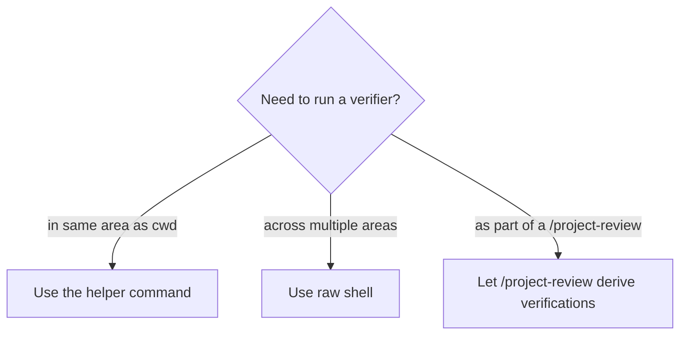

# Verification helpers

Small, area-aware commands that wrap common verification tasks. They detect the area from the cwd and run the canonical command for that area.

## `/check-types`

- **Purpose**: run the area's typecheck script.
- **Detection**: cwd → area mapping via `descriptor.json`.
- **Output**: pass/fail with file-level errors.

## `/run-tests`

- **Purpose**: run the area's test script.
- **Output**: pass/fail with focused failure list.

## `/lint-fix`

- **Purpose**: auto-fix lints where safe.
- **Output**: list of fixes applied; explicit hand-off when manual fixes are required.

## `/organize-imports`

- **Purpose**: organize and format imports for the area.

## When to prefer these vs raw shell

These helpers are convenience wrappers — they do not produce structured artifacts and do not write to durable knowledge. Reach for `/project-review` when you want a recorded review pass with deterministic verifications.
