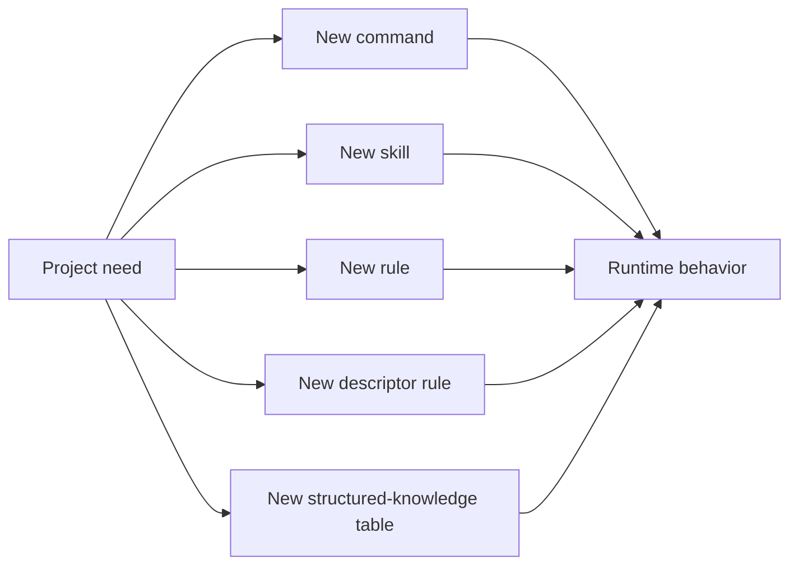
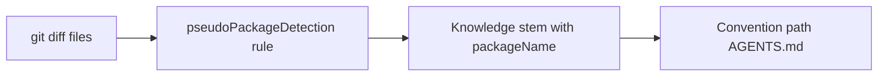
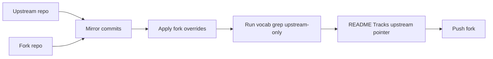

# Extending the Kit

This page is the tutorial for contributors who want to add or upgrade kit assets. It pairs with the contract version at `documentation/EXTENDING.md`.

## What you can extend



You should reach for the smallest applicable extension point first:

- A `pseudoPackageDetection` rule when only path discovery changes.
- A structured-knowledge table when you want deterministic command suggestions.
- A skill when you need a reusable lens.
- A command when you need a user-invokable workflow.
- A rule only for kit-wide conventions that apply always-on.

## Adding a command (worked example)

Suppose you want a `/project-status-summary` command that prints a one-line health summary.

1. Create `commands/project-status-summary.md` with frontmatter:

```markdown
---
description: One-line summary of the project's kit health
agent: plan
subtask: true
---
```

2. Document arguments and outputs.

3. Add a structured `## Output format` block.

4. Update:

- `README.md` command tables
- `documentation/COMMAND_WORKFLOW.md` matrix
- `documentation/WORKFLOW.md` quick-pick row
- `docusaurus/commands/index.md`

5. Add a smoke test in `documentation/TEST_PLAN.md` and the corresponding bullet in `documentation/TESTING_THE_KIT.md`.

## Adding a skill (worked example)

Suppose you want a `release-notes` skill that synthesizes notes from `LOG.md` and commits.

1. Create `skills/release-notes/SKILL.md`:

```markdown
---
name: release-notes
description: Synthesize human-readable release notes from LOG.md and recent commits
---
```

2. Define inputs (LOG.md path, commit range), outputs (markdown), and out-of-scope items (no auto-publishing).

3. Recommended permission: `allow` (read-only synthesis).

4. Add user-manual page at `docusaurus/skills/release-notes.md`.

## Adding a descriptor rule

Add or modify rules under `pseudoPackageDetection` in your project's `descriptor.json`. Always include `area`, `kind`, and `pathPattern`. Run `/scaffold-knowledge <key> dry-run` to preview convention paths before committing.



## Adding a structured-knowledge table

Place under area-level `AGENTS.md` with a clear `## <Block Name>` heading and the schema table:

```markdown
## Verification scripts

| Trigger | Command | When |
| --- | --- | --- |
| `area/**/*.ts` | `bun run typecheck` | quick local feedback |
| `area/**/*.test.ts` (added or modified) | `bun run test` | run focused tests |
```

Verify that `/project-review` deterministically uses the rules on the next run.

## Mirroring upstream changes to a fork



Steps:

1. Pull upstream and pick the target commit.
2. Apply the change to the fork; preserve fork-specific frontmatter.
3. Bump `README.md` `Tracks upstream:` pointer.
4. Update `CHANGELOG.md` `### Fork` block.

## Validation checklist

- Frontmatter is correct.
- No vendor-specific terms in upstream sources.
- Audit blocks follow contract.
- Both `documentation/` (contract) and `docusaurus/` (tutorial) updated.
- `documentation/FAQ.md` and `docusaurus/faq/` updated when behavior changes user-facing.
- Smoke tests updated.

## Anti-patterns

- Embedding `$ARGUMENTS` in shell-injection blocks.
- Skills loading other skills.
- Mutating commands without audit blocks.
- Adding domain-specific terms to upstream files.
- Writing durable knowledge without a pre-write secret scan.
