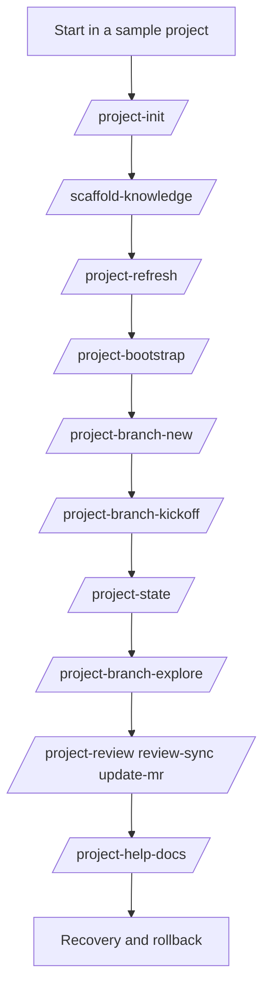

# Testing the Kit with OpenCode

This page walks you through testing every command and skill in the kit using OpenCode itself, so you can verify a fresh install or a contribution end to end.

The terse contract version of this workflow lives at `documentation/TESTING_THE_KIT.md`. The complete smoke-test script with setup details lives at `documentation/TEST_PLAN.md`.

**Bun engine sanity (optional):** `bun build tools/_opencode_engine.ts --target=bun --outfile=/tmp/opencode-engine-check.js` — the bundler defaults to a browser target without **`--target=bun`**, which can fail on Node built-ins.

## Why a tutorial page

You are reading this if you want to:

- Verify a new install works
- Validate a kit upgrade after `git pull`
- Confirm a contribution behaves as documented
- Onboard a teammate by walking the kit lifecycle once

This page is procedural and example-rich. Open the kit in a terminal and run along.

## High-level test traversal



## Setup

1. Pick a sample repo (greenfield is fine).
2. Install the kit: `bash bin/install-opencode-conductor.sh`.
3. Confirm OpenCode discovers the commands and skills.
4. Confirm `permission.skill` policy in your `~/.config/opencode/opencode.json` matches `opencode.json.example`.

## 1. Initialize

Run `/project-init <projectKey>`.

Expected highlights:

- Repo scan output
- Draft `descriptor.json` shown for approval
- After approval, `_templates/mr/`, project **rules** `AGENTS.md`, **`areas.*.areaAgentsPath`** entries (per-area **`AGENTS.md`**), and descriptor written

## 2. Scaffold shared knowledge

Run `/scaffold-knowledge <projectKey>`.

Try also:

- `/scaffold-knowledge <projectKey> list`
- `/scaffold-knowledge <projectKey> dry-run`

Verify safety: introduce a directory with a name violating the regex; verify dry-run reports `invalid_package_name` and skips it.

## 3. Refresh and bootstrap

Run `/project-refresh <projectKey>`. On a new branch, expect `missing_branch_context`. Run `/project-bootstrap <projectKey>`. Run `/project-refresh <projectKey>` again and confirm the structured `## Handoff refresh result` block (`branch_context_status`, `next_steps`, `reread_files` order: rules `AGENTS.md` → optional project `KNOWLEDGE.md` → active area doc → branch files).

**Manual-path smoke:** repeat the same sequence using **`/manual-refresh`** only (no `opencode_*` tools) and confirm the **same** handoff keys and ordering.

## 4. Branch lifecycle

Run `/project-branch-new feature/test-branch`.

Expected:

- `git-safety` preflight banner
- Per-step git confirms (`fetch`, `checkout <base>`, `pull --ff-only`, `checkout -b <new>`)
- Audit appended to `LOG.md` and MR `## OpenCode:`

Then run `/project-branch-kickoff <projectKey>`.

Expected:

- Drift gate runs silently
- `plan-phases` skill drafts `PHASES.md`
- `/scaffold-knowledge dry-run` and discovery proceed in order

Then `/project-state` to confirm the snapshot.

## 5. Explore another branch

Run `/project-branch-explore <other-branch>`. Expect a confirmed branch switch and an `EXPLORE_GUIDE.md` written with `## Setup`, `## What's new`, `## How to try it`, `## Caveats`.

## 6. Review loop

Make a small code change. Run `/project-review <projectKey>`.

Expected:

- `## Preflight summary` block
- Findings table with `F-xx` ids
- Suggested verifications derived from `## Verification scripts`

Run `/project-update-mr <projectKey>` and confirm the MR `## OpenCode:` block refreshed. Run `/project-review-sync <projectKey>` and confirm only delta updates were applied.

## 7. Help docs

Run `/project-help-docs ~/tmp/help-docs --scope=commands --scope=skills`.

Expected structured result:

```markdown
## Help docs generation result
- output_root: ~/tmp/help-docs
- scopes: commands, skills
- files_written: <n>
- frontmatter: enabled
- mermaid: enabled
- vocab_grep: enabled
- findings: none
- next_step: review and publish
```

Try `--no-frontmatter`, `--no-mermaid`, `--no-vocab-grep`, `--allow-in-repo` and verify each toggle changes the structured result.

## 8. Verification commands

Run `/check-types`, `/run-tests`, `/lint-fix`, `/organize-imports` in any area; verify each detects the area from cwd.

## 9. Recovery and rollback

If a command leaves you in a partially-changed state:

- Run `/project-state` to inspect git state and kit-stash entries.
- Drop kit-stashes you do not want with `git stash drop <ref>`.
- Remove sparse **`KNOWLEDGE.md`** (or legacy leaf `AGENTS.md`) files you no longer want; convention-path writes are non-destructive.

## Troubleshooting

- **Refused on dirty tree**: stash or commit, or accept the explicit kit-stash flow.
- **`source_missing` on scaffold**: the package directory does not exist on this branch. Add the source first or pass `no-source-guard`.
- **Drift `F-xx` finding**: pull from the integration base or use the single-file pull-up suggestion.
- **Vocab grep hit on help-docs**: rename the offending term in source-derived content or pass `--no-vocab-grep` if intentional.

## What "done" looks like

You have run init, scaffold, bootstrap, refresh, branch-new, branch-kickoff, branch-explore, state, the full review loop, and help-docs. Audit blocks appear in `LOG.md` and `MERGE_REQUEST.md`. `/project-state` reports a clean working tree with the expected branch.
