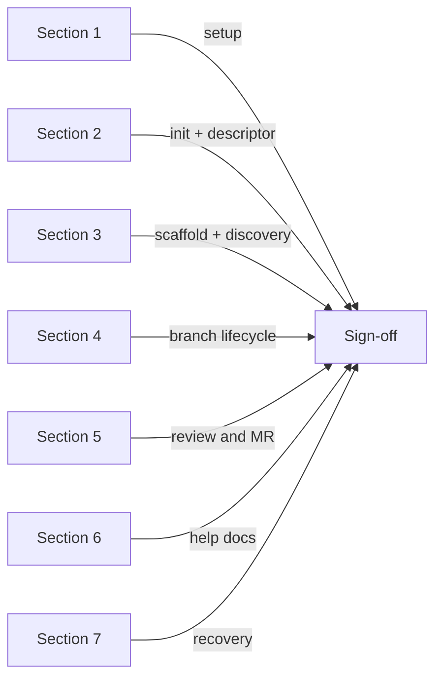

# Using `documentation/TEST_PLAN.md`

`documentation/TEST_PLAN.md` is the canonical smoke test for the kit. It describes section-by-section what to run, what to expect, and how to roll back. This page is the user-manual companion: when to use the test plan, how to interpret each section, and CI considerations.

For a procedural walkthrough that runs every command end-to-end, see [testing-the-kit](./testing-the-kit.md).

## When to run the test plan

- After upgrading the kit (`git pull`).
- After making changes to commands, skills, rules, or descriptor schemas.
- Before tagging a release.

## What each section validates



Treat each section as a green/yellow/red gate. If yellow, document the deviation in `LOG.md`. If red, do not ship.

## CI considerations

Some sections require interactive confirmations (kit-stash, branch confirms). For CI:

- Pass `no-preflight` to the relevant commands.
- Pass `no-mermaid` to skip prompts.
- For `/project-help-docs`, always set `--allow-in-repo` if you intentionally write inside an artifact path inside the repo.

## Sample local run

```text
$ /project-init my-app
... proposal ... approved ... written ...

$ /scaffold-knowledge my-app
... 3 leaves created ...

$ /project-bootstrap my-app
... templates seeded ...

$ /project-refresh my-app
## Handoff refresh result
- branch: main
- mode: tracked
- ...

$ /project-branch-new feature/test
... per-step confirms ...

$ /project-branch-kickoff my-app
... bootstrap, phases, scaffold ...

$ /project-review my-app
... preflight + findings + suggested verifications ...
```

## Cross-links

- [testing-the-kit](./testing-the-kit.md) — full tutorial walkthrough
- [extending](./extending.md) — how to add new tests when you add a command
- `documentation/TEST_PLAN.md` — the contract test script
- `documentation/TESTING_THE_KIT.md` — terse contract version
