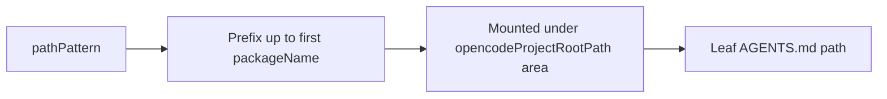

# `descriptor.json` Reference

`descriptor.json` is the per-project control-plane contract for path resolution, handoff behavior, and area discovery. It is read by virtually every command in the kit.

## Where it lives

`<projectRootPath>/descriptor.json` (default).

A v2 descriptor has shape:

```json
{
  "descriptorSchemaVersion": 2,
  "projectRootPath": "~/projects/my-app",
  "opencodeProjectRootPath": "~/.config/opencode/projects/my-app",
  "baselineBranchForMaterialChanges": "main",
  "handoffModeDefault": "tracked",
  "areas": [...],
  "branchHandoff": {...},
  "pseudoPackageDetection": [...]
}
```

## Required core fields

- `descriptorSchemaVersion` — `2` for v2.1 features.
- `projectRootPath` — absolute path to the source repo.
- `opencodeProjectRootPath` — absolute path to the conductor state root.
- `baselineBranchForMaterialChanges` — typically `main` or `master`.
- `handoffModeDefault` — `tracked` (default) or `lite`.
- `areas` — list of areas (frontend, api, cli, etc.).
- `branchHandoff` — branch artifact paths.

## `areas`

Each area defines:

- `name` — short identifier
- `areaPath` (optional) — source scope
- `areaAgentsPath` — durable knowledge file location

```json
{
  "name": "frontend",
  "areaAgentsPath": "~/.config/opencode/projects/my-app/frontend/AGENTS.md"
}
```

## `branchHandoff`

```json
{
  "contextDirTemplate": "~/.config/opencode/projects/my-app/branches/{branchName}",
  "templatesDir": "~/.config/opencode/projects/my-app/_templates/mr",
  "mrFilenames": ["MERGE_REQUEST.md", "MR.md"],
  "logFilename": "LOG.md",
  "phasesFilename": "PHASES.md"
}
```

## `pseudoPackageDetection` (schema v2)

An ordered array of rules. Each rule maps source-tree paths to convention-path knowledge files.

```json
{
  "area": "frontend",
  "kind": "pathAndAlias",
  "pathPattern": "frontend/src/{packageName}/**/*",
  "aliases": ["@app/{packageName}"]
}
```

### Fields

- `area` — must match an `areas[].name`.
- `kind` — `pathAndAlias` or `pathPrefix`.
- `pathPattern` — must contain `{packageName}` exactly once.
- `aliases` (optional) — recognized import aliases.
- `namePrefixes` (optional) — restrict matched package names.
- `namedExtras` (optional) — explicit additional package names.

### Stem derivation contract

The knowledge stem is the prefix of `pathPattern` up to and including the first `{packageName}` token, with that token removed. This stem becomes part of the leaf `AGENTS.md` path.



## Minimal v2 example

```json
{
  "descriptorSchemaVersion": 2,
  "projectRootPath": "~/projects/my-app",
  "opencodeProjectRootPath": "~/.config/opencode/projects/my-app",
  "baselineBranchForMaterialChanges": "main",
  "handoffModeDefault": "tracked",
  "areas": [
    { "name": "frontend", "areaAgentsPath": "~/.config/opencode/projects/my-app/frontend/AGENTS.md" },
    { "name": "api",      "areaAgentsPath": "~/.config/opencode/projects/my-app/api/AGENTS.md" }
  ],
  "branchHandoff": {
    "contextDirTemplate": "~/.config/opencode/projects/my-app/branches/{branchName}",
    "templatesDir": "~/.config/opencode/projects/my-app/_templates/mr",
    "mrFilenames": ["MERGE_REQUEST.md", "MR.md"],
    "logFilename": "LOG.md",
    "phasesFilename": "PHASES.md"
  },
  "pseudoPackageDetection": [
    {
      "area": "frontend",
      "kind": "pathAndAlias",
      "pathPattern": "frontend/src/{packageName}/**/*",
      "aliases": ["@app/{packageName}"]
    },
    {
      "area": "api",
      "kind": "pathPrefix",
      "pathPattern": "api/{packageName}/**/*",
      "namePrefixes": ["core_", "feature_"]
    }
  ]
}
```

## Safety and normalization

- All path templates are normalized at load-time.
- Symlinks are refused (containment).
- Paths that escape `opencodeProjectRootPath` are rejected.
- Tilde expansion is performed once and then locked.

## Canonical contracts

- `documentation/PATH_CONTRACT.md`
- `documentation/UPGRADING.md`
- `descriptors/descriptor.template.json` (in-repo template)
