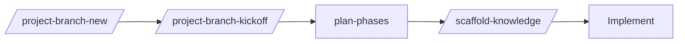

# Big-Project Kickoff FAQ

## How do I start a big project on a fresh branch?

Run `/project-branch-new`, then `/project-branch-kickoff`. The kickoff orchestrates bootstrap or refresh, phases planning, and scaffold-knowledge in one auditable run.

## What's the difference between `/project-branch-new` and `/project-branch-kickoff`?

- `/project-branch-new` is purely a git operation with audit guards.
- `/project-branch-kickoff` is the knowledge-and-planning seeding run.

Use them in sequence: new first, then kickoff.

## Can I avoid copy-pasting prompts?

Yes. The kickoff command runs the canonical prompt for you. You only need to make decisions when prompted: model choice, mermaid inclusion, scaffold dry-run vs apply.

## Can I spawn a subtask with a specific model after I pick one?

Yes. The kickoff command prompts for a model and (when configured via `subtaskModels`) spawns the subtask with that selection.

## See also

- [commands/branch-lifecycle](../commands/branch-lifecycle.md)
- [skills/branch-kickoff](../skills/branch-kickoff.md)
