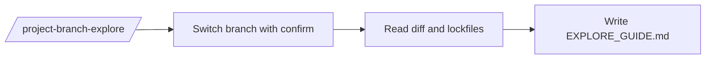

# Branch Explore FAQ

## How do I try a feature branch in the browser without browser automation?

Run `/project-branch-explore <branch>`. It writes `EXPLORE_GUIDE.md` with `## Setup`, `## What's new`, `## How to try it`, `## Caveats`, including:

- The localhost URL or domain to visit.
- The buttons or actions to click.
- Any `bun install` or `pip install` you need to run first (based on lockfile diffs).

The kit does not open the browser or run installs for you.

## What is `EXPLORE_GUIDE.md`?

A per-branch ephemeral guide. Re-running the command overwrites it. It is not committed by default.

## Will the kit auto-run `bun install` / `pip install`?

No. It surfaces them as setup steps if lockfiles changed.

## See also

- [commands/branch-lifecycle](../commands/branch-lifecycle.md)
- [skills/branch-explore](../skills/branch-explore.md)
