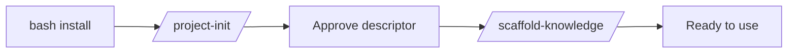

# Getting Started

## How do I set up the kit on a project?

1. Run the install script from the kit repo: `bash bin/install-opencode-conductor.sh`.
2. From inside your target project, run `/project-init <projectKey>`.
3. Approve the proposed `descriptor.json`.
4. Optionally run `/scaffold-knowledge <projectKey>` to seed durable knowledge.

## Global vs project-local state — which should I pick?

Default to **global** (state under `~/.config/opencode/projects/<key>/`). Choose project-local when:

- You need true isolation between checkouts.
- You want to commit kit state to source control.

Bump `descriptorSchemaVersion` accordingly and follow `documentation/UPGRADING.md`.

## What does `/project-init` actually do?

- Scans the repo for area candidates.
- Drafts a `descriptor.json` with `pseudoPackageDetection` rules tailored to detected layouts.
- Seeds `_templates/mr/` and project-level `AGENTS.md`.
- Refuses to overwrite an existing descriptor; requires explicit approval to write.

## See also

- `documentation/PATH_CONTRACT.md` § Setup
- [commands/init-and-refresh](../commands/init-and-refresh.md)
