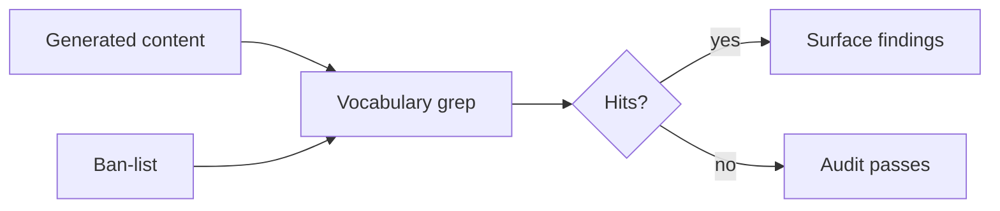

# Help Docs Authoring FAQ

## What does `/project-help-docs` do?

It generates end-user help-center documentation from code via a five-phase workflow: Discovery, Code-reading, Plan, Generation, Audit.

## Why does it refuse in-repo writes by default?

To prevent accidentally committing user-facing docs into the source repo. The output belongs in a separate site repo or pipeline artifact path. Pass `--allow-in-repo` to opt in.

## What is the vocabulary ban-list?

A list of forbidden terms checked post-generation. Upstream's default is empty. Forks may preload terms (internal codenames, deprecated stack identifiers) so generated docs never leak them. You can extend per-run with `--ban-term=<term>`.

## How do I ship to my docs site?

Point `--output-root` at your site repo's docs directory or a CI artifact path, then publish from there in your pipeline. The kit does not deploy.

## See also

- [help-docs-authoring/index.md](../help-docs-authoring/index.md)
- [skills/help-docs-author](../skills/help-docs-author.md)
- [commands/help-docs](../commands/help-docs.md)
