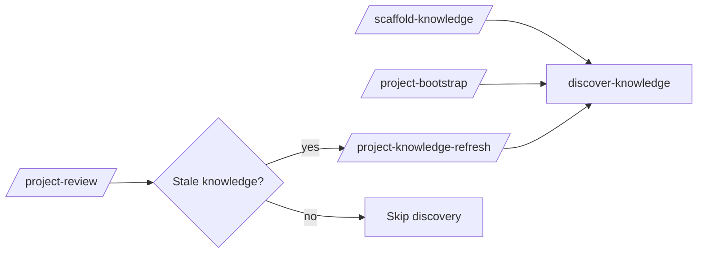

# Knowledge System FAQ

## When does knowledge discovery happen?

Discovery runs on `/scaffold-knowledge`, on `/project-bootstrap`, on `/project-knowledge-refresh`, and inside `/project-review` when the preflight detects stale knowledge.

## Is `AGENTS.md` for agents only?

No — it is dual-audience. Sections answer both human and agent questions. The `## Verification scripts` table is consumed deterministically by `/project-review`; the prose is for humans.

## What if `<area>/packages/<pkg>` does not match my repo layout?

Use `pseudoPackageDetection` rules. The `pathPattern` can be any glob ending with `{packageName}/...`. The stem derivation contract translates that pattern into a knowledge directory under `opencodeProjectRootPath`.

## How do I add behaviors for tracked packages?

Add structured-knowledge tables to area-level `AGENTS.md`:

- `## Verification scripts` — drives `/project-review` suggestions.
- `## Run locally` — drives developer-side runners.

## What if branches differ on master/main?

The drift preflight will emit `F-xx` findings and recommend single-file pull-ups. The kit does not rebase for you.

## See also

- [knowledge/index.md](../knowledge/index.md)
- `documentation/PATH_CONTRACT.md`
