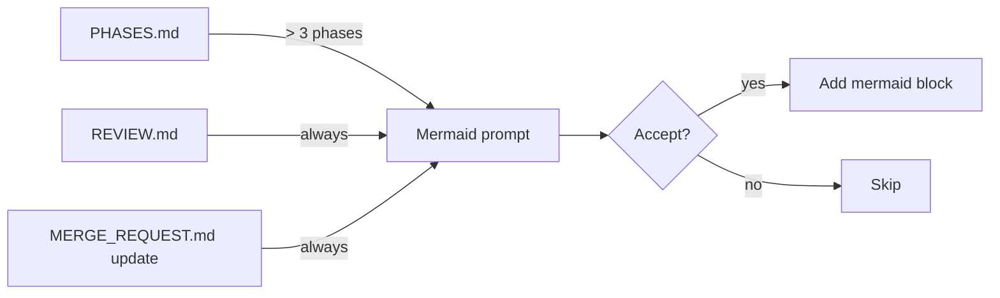

# Mermaid and Audit FAQ

## When should I include mermaid diagrams?

Default is opt-in across artifacts. Diagrams should clarify decision flow, not decorate.

## What is the audit trail contract?

Every mutating command:

- Appends `### <Activity>` to `LOG.md`.
- Refreshes `## OpenCode:` machine block in `MERGE_REQUEST.md`.
- Notes whether pre-write secret scan ran clean.
- Notes whether source-path guard fired and was honored or bypassed.

## What's the kit-stash convention?

Stash entries created by the kit are named `kit-stash:<command>:<ref>`. On branch return, `git-safety` checks for kit-stash entries and surfaces a reminder so you don't lose work.

## See also

- `documentation/PATH_CONTRACT.md` § Audit trail
- [skills/git-safety](../skills/git-safety.md)
