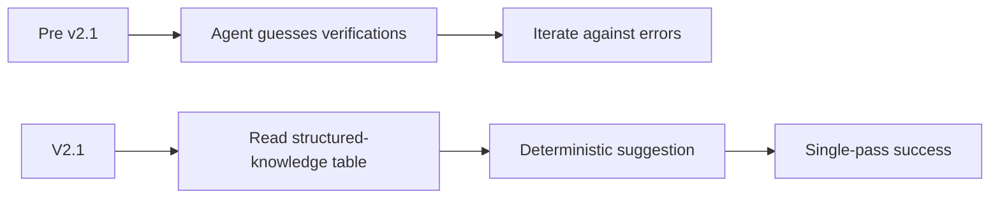

# Model Routing and Cost FAQ

## Which model do you recommend for kickoff?

The latest reasoning-capable model your provider offers. Kickoff explicitly prompts you to pick one — it does not guess. Forks may preload a recommendation; upstream stays vendor-neutral.

## How does the cost analysis hold post-v2.1?

V2.1 reduces review iteration cost via deterministic verification suggestions. Per-review the agent no longer guesses what to run; structured-knowledge tables short-circuit that loop. The cost analysis in `documentation/UPGRADING.md` reflects this.

## What is `subtask: true` vs `false` and why?

- `subtask: true` — command runs in a subtask context. Cheaper, isolated, returns a concise summary. Use for read-mostly delegations and idempotent flows.
- `subtask: false` — command runs in the primary context. Required when the user must directly observe and audit the actions (kickoff family).

## How do `subtaskModels` work?

Per-command override map in your OpenCode config. When a command has `subtask: true` and you've configured a `subtaskModels` entry for it, that model is used for the subtask spawn.

## See also

- `documentation/COMMAND_WORKFLOW.md`
- `documentation/UPGRADING.md`
