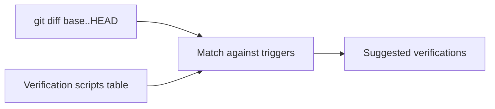

# Reviews and Verification FAQ

## How does `/project-review` choose verification commands?

It reads the area-level `## Verification scripts` table and matches the diff against trigger globs and the optional `(added or modified)` qualifier. Any matching row contributes its `Command` to the suggestion list.



## Why didn't it suggest my `setup-lint` script?

Because there is no row whose trigger glob matches the changed paths. Add a row:

```markdown
| `frontend/eslint-plugin-*/**/*` | `bun run setup-lint` | rebuild lint plugin |
```

## What is the missing-block `F-xx` finding?

A finding emitted when an area's `AGENTS.md` lacks an expected block (e.g., `## Verification scripts`). It does not block review; it tells you the block is missing so review suggestions can become richer.

## What is the knowledge-drift preflight?

A diff of `AGENTS.md` files against the integration base, run before review and refresh flows. It emits `F-xx` findings for stale knowledge and suggests single-file pull-ups.

## When does mermaid get added to `REVIEW.md` / `PHASES.md` / `MERGE_REQUEST.md`?

- `REVIEW.md` — opt-in prompt; default no.
- `PHASES.md` — opt-in prompt when the phase count exceeds 3.
- `MERGE_REQUEST.md` — opt-in prompt during update flows.

## See also

- [commands/review-and-mr](../commands/review-and-mr.md)
- [knowledge/index.md](../knowledge/index.md)
