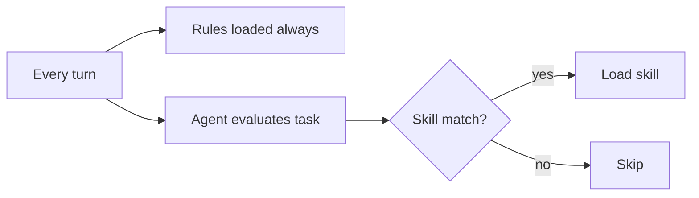

# Skills vs Commands vs Rules FAQ

## What is a skill?

An on-demand procedural lens defined in `skills/<name>/SKILL.md`. The agent loads it when relevant. See [opencode.ai/docs/skills](https://opencode.ai/docs/skills).

## Is `git-safety` only a skill — how do I invoke it?

It is a skill. Users do not invoke it directly. It is loaded automatically by every mutating command in the kit. The user-facing entry point for inspecting kit-safety state is `/project-state`.

## When are rules loaded vs skills?

Rules are always-on. Skills are on-demand.

## Why does the kit recommend `permission.skill: ask` for some skills?

Mutating skills (those that write `LOG.md`, `MERGE_REQUEST.md`, `AGENTS.md`, `REVIEW.md`, `EXPLORE_GUIDE.md`, `PHASES.md`) should require explicit consent before running. Non-mutating skills can be `allow`.

## See also

- [skills/index.md](../skills/index.md)
- `documentation/PATH_CONTRACT.md` § Permissions
