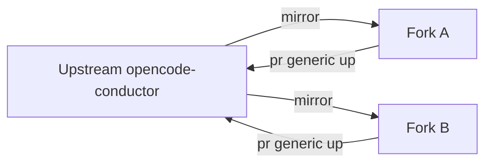

# Vendor Neutrality and Fork FAQ

## Why upstream-first?

Generic improvements stay in the upstream `opencode-conductor`. Forks adopt them by mirroring. This avoids drift between projects that share the kit.

## Why does the fork exist?

For vendor-specific overrides: model defaults, ban-lists, integrations, and domain-specific commands that should never live in upstream.

## What goes upstream vs fork-only?

- Upstream: generic commands, generic skills, generic rules, generic descriptor schema.
- Fork-only: brand or domain-specific defaults, integrations, ban-list preloads, additional commands tied to vendor systems.

## How do I bump `Tracks upstream:`?

Update the README pointer in your fork to the new upstream short SHA after mirroring. This is documented in `documentation/UPGRADING.md`.

## See also

- `documentation/UPGRADING.md`
- [contributing/extending](../contributing/extending.md)
