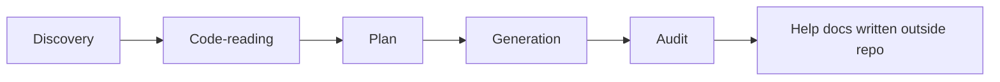

# Help Docs Authoring

`/project-help-docs` and `skills/help-docs-author` provide a deterministic workflow for generating end-user help-center documentation from code.

## Five phases



### Phase 1 — Discovery

- Inputs: `--scope`, `--audience`, `--brand`, source code under each scope.
- Outputs: feature inventory and target audience set.

### Phase 2 — Code-reading

- Read each feature's source code and extract behavior, defaults, edge cases, error states.
- Output: per-feature behavior summary.

### Phase 3 — Plan

- Output: page outlines with frontmatter, audience tags, cross-links.
- This is the user's last chance to course-correct before generation.

### Phase 4 — Generation

- Produce markdown files under `<output-root>` with:
  - Frontmatter (`title`, `audience`, `feature`).
  - Mermaid diagrams where they clarify flow.
  - Worked examples derived from code.
- Containment: every write must resolve under `<output-root>`.

### Phase 5 — Audit

- Vocabulary grep against the ban-list.
- Secret scan over generated content.
- Output containment check.
- Emit a structured `## Help docs generation result` block.

## Worked example

```text
/project-help-docs ~/tmp/help-docs --scope=onboarding --audience=admin --brand=ACME

## Help docs generation result
- output_root: ~/tmp/help-docs
- scopes: onboarding
- audiences: admin
- files_written: 7
- frontmatter: enabled
- mermaid: enabled
- vocab_grep: enabled
- findings: none
```

## Opt-out flags

- `--no-frontmatter`
- `--no-mermaid`
- `--no-vocab-grep`
- `--allow-in-repo`

Use these only with intent — each disables a safety guard.

## Vocabulary ban-list

The default upstream ban-list is empty. Forks may preload terms that should never appear in user-facing docs (internal codenames, partner names, deprecated stack identifiers). You can add per-run terms with `--ban-term=<term>`.

## Output containment

The skill resolves the absolute path of each candidate file and refuses to write if the path is not a descendant of `<output-root>`. This makes it safe to point `<output-root>` at, e.g., `~/sites/company-help-center/docs` without risk of cross-writing.

## See also

- [skills/help-docs-author](../skills/help-docs-author.md)
- [commands/help-docs](../commands/help-docs.md)
