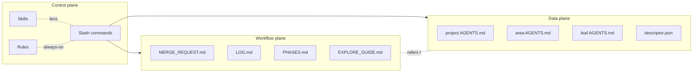
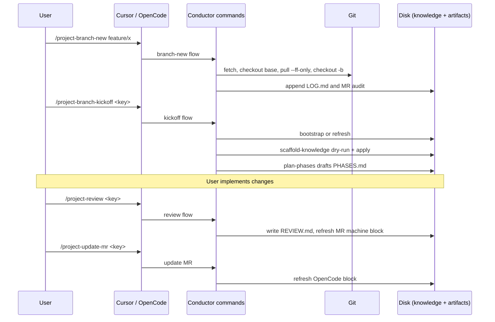

# OpenCode Conductor

Welcome to the OpenCode Conductor user manual. This site is the human-facing tutorial layer over the contract-style documentation in `documentation/`. Pages here are deliberately verbose, example-rich, and diagram-heavy. Use them when you want to learn the kit; fall back to `documentation/` when you need the canonical contract.

## What problem this kit solves

Modern AI coding agents are powerful but stateless. They forget what they learned five minutes ago, repeat work, and produce inconsistent durable artifacts (READMEs, AGENTS.md, MR descriptions, audit logs). The Conductor adds a thin, deterministic control plane on top of OpenCode that:

- Persists project knowledge in a predictable hierarchy of `AGENTS.md` files.
- Persists branch and session knowledge in `MERGE_REQUEST.md`, `LOG.md`, and optional `PHASES.md`.
- Routes commands to the right model with the right `subtask` semantics for cost vs. context fidelity.
- Refuses unsafe writes, enforces vendor neutrality upstream, and emits structured audit blocks every time the agent mutates state.
- Surfaces drift early — in branch kickoff, in reviews, and on branch return.

You operate it through a small set of slash commands and a set of always-on rules and on-demand skills.

## Mental model in 3 minutes



Three planes, three responsibilities:

- **Control plane** — slash commands, skills, and rules that decide what the agent does next.
- **Workflow plane** — branch and session artifacts that capture the running narrative of work.
- **Data plane** — durable knowledge artifacts that survive across branches and sessions.

## Tour of the repo

```
opencode-conductor/
├── README.md                 # Top-level entry, command tables
├── CHANGELOG.md              # Release notes
├── SECURITY.md               # Security policy
├── opencode.json.example     # Example permission/skill config
├── bin/                      # Install scripts
├── commands/                 # User-invokable slash commands
├── skills/                   # On-demand procedural skills
├── rules/                    # Always-on rules
├── descriptors/              # Templates for descriptor.json
├── _templates/               # Branch artifact templates
├── documentation/            # Contract docs (terse, normative)
└── docusaurus/               # User manual (this site)
```

The `documentation/` and `docusaurus/` planes are intentionally parallel:

- `documentation/` is the contract: short, normative, indexable by the agent.
- `docusaurus/` is the manual: long, narrative, diagram-rich, indexable by humans.

When the two diverge, `documentation/` wins. The site links back to `documentation/` for canonical paths, schemas, and invariants.

## End-to-end worked example

Suppose you want to add a feature to a project under conductor management. The lifecycle looks like this.



Each step is described in detail under [`workflows/scenarios.md`](./workflows/scenarios.md) and at the contract level in `documentation/WORKFLOW.md`.

## How to read this site

- Start with [Commands](./commands/index.md) if you want to know what is invokable.
- Read [Skills](./skills/index.md) to understand on-demand lenses.
- Read [Knowledge System](./knowledge/index.md) for the AGENTS.md hierarchy.
- Read [Workflows](./workflows/scenarios.md) for canonical scenarios.
- Read [Architecture](./architecture/01-mental-model.md) (10 short pages) for the inner workings.
- Read [FAQ](./faq/index.md) when you remember the question better than the section name.
- Use [Contributing](./contributing/testing-the-kit.md) when you want to test or extend the kit.

## Cross-links to the contract

| Topic | Site page (manual) | Contract source |
| --- | --- | --- |
| Knowledge paths and schema | [knowledge/index.md](./knowledge/index.md) | `documentation/PATH_CONTRACT.md` |
| Workflows | [workflows/scenarios.md](./workflows/scenarios.md) | `documentation/WORKFLOW.md` |
| Command picking | [commands/index.md](./commands/index.md) | `documentation/COMMAND_WORKFLOW.md` |
| Smoke tests | [contributing/testing.md](./contributing/testing.md) | `documentation/TEST_PLAN.md` |
| Upgrades | site `architecture/06-extension-points.md` | `documentation/UPGRADING.md` |
| Roadmap | n/a | `documentation/ROADMAP.md` |

If a page on this site contradicts `documentation/`, the contract wins and the site is wrong — please file an issue or PR.
