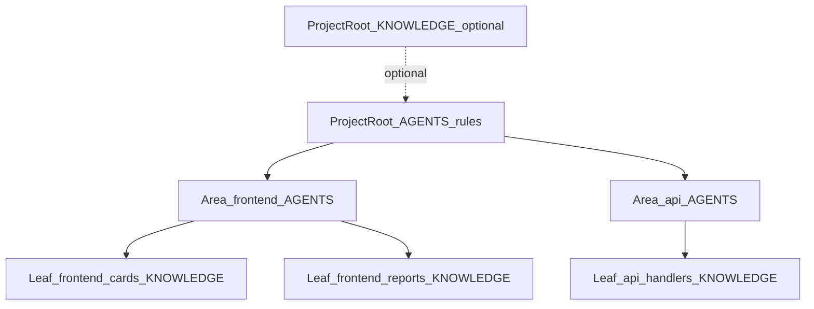
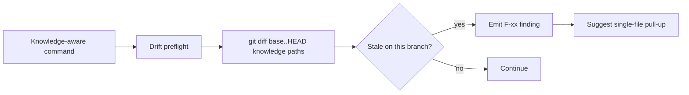

# Knowledge System

Knowledge in this kit is dual-audience (agents and humans) and layered. This page is the user-manual-level guide. The contract specification lives at `documentation/PATH_CONTRACT.md`.

## Three layers



- **Project `AGENTS.md`** — top-level **rules**: session lifecycle, kit behavior, ownership pointers.
- **Project `KNOWLEDGE.md`** *(optional)* — durable **facts** kept separate from rules (long glossary, integration notes). When present, refresh includes it after rules `AGENTS.md`.
- **Area `AGENTS.md`** — default per-area anchor from `/project-init` (`areaAgentsPath`): stack, folder layout, conventions, structured-knowledge tables (`## Verification scripts`, future `## Run locally`).
- **Leaf `KNOWLEDGE.md`** — pseudo-package / module knowledge at the [source-tree-mirror convention](../../documentation/PATH_CONTRACT.md) path. Optional **leaf `AGENTS.md`** is an escape hatch for hard behavioral contracts beside the same stem; prefer `KNOWLEDGE.md` for descriptive architecture.

## Source-tree-mirror convention (leaves)

The default convention is that the *path* to a leaf **`KNOWLEDGE.md`** mirrors the source tree:

```
opencodeProjectRootPath/<rel>/KNOWLEDGE.md
```

where `<rel>` is derived from `pseudoPackageDetection.pathPattern`: prefix up to and *including* the first `{packageName}` token, with the placeholder replaced by the package directory name (see [`documentation/PATH_CONTRACT.md`](../../documentation/PATH_CONTRACT.md) § Stem derivation contract).

### Worked example 1 — frontend with `src` layout

Source: `frontend/src/cards/CardList.tsx`

Rule: `area: frontend, kind: pathAndAlias, pathPattern: "frontend/src/{packageName}/**/*"`

Stem: `frontend/src/cards`

Knowledge: `<opencodeProjectRootPath>/frontend/src/cards/KNOWLEDGE.md`

### Worked example 2 — api with explicit prefix

Source: `api/sp_specimens/gql/handlers.py`

Rule: `area: api, kind: pathPrefix, pathPattern: "api/{packageName}/**/*", namePrefixes: ["sp_", "dc_"]`

Stem: `api/sp_specimens`

Knowledge: `<opencodeProjectRootPath>/api/sp_specimens/KNOWLEDGE.md`

### Worked example 3 — flat repo

Source: `cli/main.py`

Rule: `area: cli, kind: pathPrefix, pathPattern: "cli/{packageName}/**/*"` with `aliases: ["@cli/{packageName}"]`

Stem: `cli/main`

Knowledge: `<opencodeProjectRootPath>/cli/main/KNOWLEDGE.md`

## Dual-audience contract

Every leaf **`KNOWLEDGE.md`** should answer:

- **For humans**: What does this package do? Who owns it? What conventions apply?
- **For agents**: What's the public surface? What invariants must I preserve? What verification commands apply?

A typical leaf **`KNOWLEDGE.md`** has these sections:

```markdown
# <packageName>

## Purpose
## Public surface
## Internal layout
## Conventions
## Verification scripts (optional, area-level usually)
## Risks and gotchas
## See also
```

## Structured knowledge tables

Two tables drive deterministic behavior:

### `## Verification scripts`

```markdown
## Verification scripts

| Trigger | Command | When |
| --- | --- | --- |
| `frontend/**/*.ts` | `bun run typecheck` | quick local feedback |
| `frontend/**/*.test.ts` (added or modified) | `bun run test` | run focused tests |
| `frontend/eslint-plugin-*/**/*` | `bun run setup-lint` | rebuild lint plugin |
| `**/*.story.tsx` (added) | `bun scripts/collect-stories.ts` | regen story index |
```

The trigger is a glob (matched against `git diff --name-only`). The optional `(added or modified)` qualifier filters by change kind. `/project-review` matches the diff against these triggers and emits the matching commands as suggested verifications.

### `## Run locally`

(Forthcoming.) Same shape; describes commands a developer runs to exercise the area locally.

## Drift preflight

Whenever a knowledge-aware command runs, it may diff durable knowledge files (`**/*KNOWLEDGE.md`, legacy `**/AGENTS.md` beside leaves) against the integration base branch per command contracts.



Findings show up in `REVIEW.md` and as warnings during `/project-knowledge-refresh`.

## Audit trail

Every knowledge mutation:

- Appends `### Knowledge update` to `LOG.md`.
- Refreshes the machine block in `MERGE_REQUEST.md`.
- Notes whether a pre-write secret scan ran.
- Notes whether the source-path guard fired and was honored or bypassed.

## See also

- `documentation/PATH_CONTRACT.md` — full contract.
- [descriptors/descriptor-json.md](../descriptors/descriptor-json.md) — schema reference.
- [commands/knowledge-maintenance.md](../commands/knowledge-maintenance.md) — operator commands.
