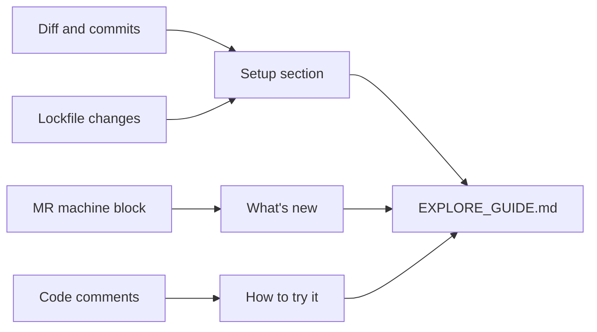

# branch-explore

Advisory skill loaded by `/project-branch-explore`. Produces an `EXPLORE_GUIDE.md` per branch.

## What it does

1. Loads `git-safety` to confirm clean tree.
2. Switches to the target branch (with confirm).
3. Reads diff, recent commits, and MR machine block to derive features.
4. Reads requirements/`package.json` lockfiles to derive setup commands.
5. Writes `EXPLORE_GUIDE.md` with `## Setup`, `## What's new`, `## How to try it`, `## Caveats`.
6. Does **not** open a browser, run tests, or run installs.

## Output

## Permissions

Recommended `permission.skill: ask`.

## See also

- `commands/project-branch-explore.md`
- `documentation/WORKFLOW.md` § Branch exploration
