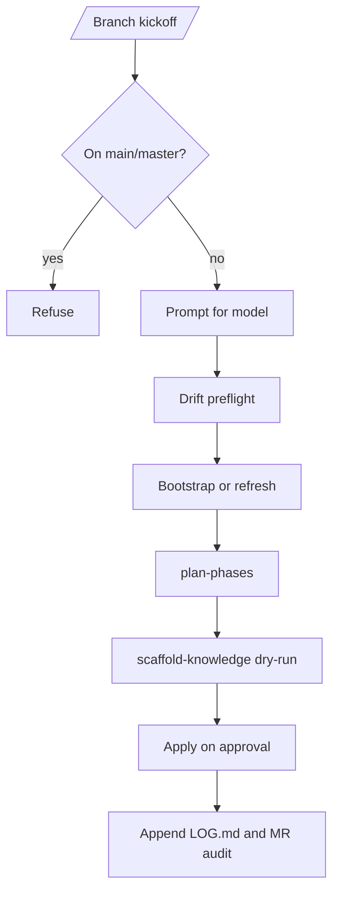

# branch-kickoff

Procedural lens that orchestrates the branch kickoff flow on top of `/project-branch-kickoff`.

## What it does

1. Refuses on `main`/`master`.
2. Prompts for model.
3. Runs knowledge-drift preflight (silent-on by default; opt-out with `no-preflight`).
4. Calls bootstrap-or-refresh as appropriate.
5. Drafts `PHASES.md` via the `plan-phases` skill (mermaid prompt when phases > 3).
6. Calls `/scaffold-knowledge` in dry-run, then applies after approval.
7. Appends a comprehensive audit block to `LOG.md` and `MERGE_REQUEST.md`.

## Diagram

## Inputs / outputs

- Inputs: project key, current branch, optional `no-preflight`, `no-mermaid`.
- Outputs: structured kickoff result block, audit blocks, optional `PHASES.md`.
