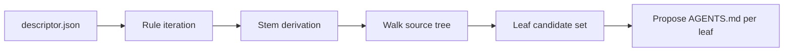

# discover-knowledge

Skill responsible for translating project files into convention-path `AGENTS.md` content.

## What it does

1. Reads `descriptor.json` and resolves `pseudoPackageDetection` rules.
2. For each rule, derives knowledge stems via the prefix-up-to-`{packageName}` contract.
3. Walks the source tree and groups files into leaf candidates.
4. Drafts content for each leaf, respecting the source-tree-mirror convention.
5. Returns a proposal block to `/scaffold-knowledge` or `/project-knowledge-refresh`.

## Diagram

## Outputs

- Proposal block consumed by `scaffold-knowledge` or `project-knowledge-refresh`.
- Audit trail entry on apply.

## See also

- `documentation/PATH_CONTRACT.md` § Knowledge stem derivation.
- [knowledge/index.md](../knowledge/index.md) for the user-manual-level guide.
