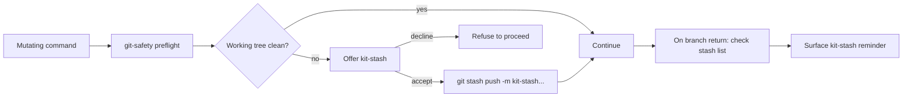

# git-safety

Foundational safety primitive used by every mutating command in the kit.

## Purpose

- Run a preflight check before any branch-changing or mutating action.
- Detect and surface kit-stash entries on branch return.
- Enforce a per-step git confirm flow for branch creation and switching.

## Diagram

## Inputs

- Current cwd and branch
- Operation type (`branch-new`, `branch-switch`, `mutating-write`)
- User confirmation tokens

## Outputs

- Banner block reporting safety state
- `LOG.md` entry on stash push
- Reminder banner on stash list non-empty

## Invocation

This skill is not invoked directly by the user. The user-facing entry point for inspecting kit-safety state is `/project-state`. Mutating commands load this skill automatically.

## Permission

Recommended `permission.skill: ask` because it can stash uncommitted changes.

## See also

- `documentation/PATH_CONTRACT.md` § Audit trail
- `commands/project-branch-new.md`
- `commands/project-state.md`
