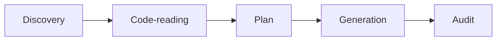

# help-docs-author

Skill behind `/project-help-docs`. Generates end-user help-center documentation from code.

## Five-phase workflow

| Phase | Inputs | Outputs |
| --- | --- | --- |
| Discovery | scopes, audiences, brand | feature inventory |
| Code-reading | source under each scope | extracted behaviors |
| Plan | feature inventory + behaviors | page outlines |
| Generation | page outlines | markdown files |
| Audit | generated files | vocab grep, secret scan, containment check |

## Defaults

- Frontmatter on
- Mermaid on
- Vocabulary grep on
- In-repo writes off

## Configurable

- `--ban-term=<term>` to extend the vocab list
- `--no-frontmatter`, `--no-mermaid`, `--no-vocab-grep` to opt out
- `--allow-in-repo` to allow writes inside the repo

## Output containment

Writes outside `<output-root>` are refused. The skill verifies the resolved absolute path is a descendant of `<output-root>` before each write.

## See also

- [commands/help-docs.md](../commands/help-docs.md)
- [help-docs-authoring/index.md](../help-docs-authoring/index.md)
