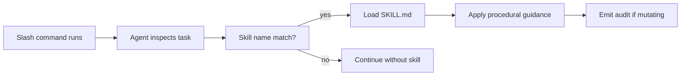

# Skills

Skills are on-demand procedural lenses. They live in `skills/<name>/SKILL.md` and are loaded by the agent when relevant. Skills do not load other skills (the only foundational primitive is `git-safety`).

OpenCode platform reference: [opencode.ai/docs/skills](https://opencode.ai/docs/skills).

## Catalog

| Skill | Loaded by | Mutates state | Recommended permission |
| --- | --- | --- | --- |
| [git-safety](./git-safety.md) | mutating commands | indirectly (via stash) | `ask` |
| [branch-kickoff](./branch-kickoff.md) | `/project-branch-kickoff` | yes | `ask` |
| [branch-explore](./branch-explore.md) | `/project-branch-explore` | yes (EXPLORE_GUIDE.md) | `ask` |
| [discover-knowledge](./discover-knowledge.md) | scaffold + review flows | yes (AGENTS.md) | `ask` |
| [plan-phases](./plan-phases.md) | kickoff + on demand | yes (PHASES.md) | `ask` |
| [review-branch](./review-branch.md) | `/project-review` | yes (REVIEW.md) | `ask` |
| [help-docs-author](./help-docs-author.md) | `/project-help-docs` | yes (out-of-repo) | `ask` |
| [onboard-area](./onboard-area.md) | on demand | no | `allow` |
| [refactor-safely](./refactor-safely.md) | on demand | no | `allow` |
| [session-lifecycle](./session-lifecycle.md) | on demand | yes (LOG.md) | `ask` |
| [systematic-debugging](./systematic-debugging.md) | on demand | no | `allow` |
| [verify-changes](./verify-changes.md) | on demand | no | `allow` |
| [write-tests](./write-tests.md) | on demand | yes (test files) | `ask` |

## Loading model

## Skill vs command vs rule

- **Skill**: on-demand procedural lens, agent-loaded, has frontmatter (`name`, `description`).
- **Command**: user-invokable slash command with frontmatter and argument handling.
- **Rule**: always-on guidance loaded at every turn.

If a behavior should apply *every* time, write a rule. If it should apply only when relevant, write a skill. If a user should explicitly trigger it, write a command.
