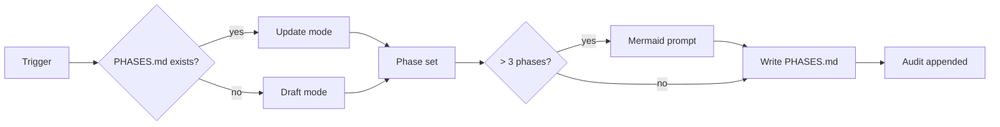

# plan-phases

Skill that drafts and updates `PHASES.md` for big-project work.

## What it does

1. Reads existing `PHASES.md` if present.
2. Engages user in a structured dialog (problem, scope, deliverables, risks).
3. Drafts a numbered phase list with verification gates.
4. Prompts for inclusion of a mermaid roadmap when phase count > 3 (configurable).
5. Writes `PHASES.md` with audit footer.

## Diagram

## Outputs

- `PHASES.md` with one section per phase.
- Each phase has goals, verification gates, and risks.
- Optional top-level mermaid roadmap.

## See also

- `commands/project-phases.md`.
- `commands/project-branch-kickoff.md`.
