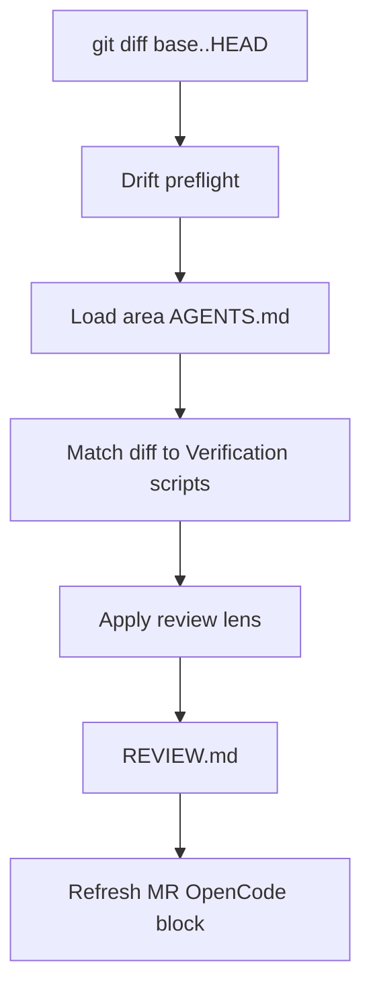

# review-branch

Skill behind `/project-review` and `/project-review-sync`.

## Behavior

1. Reads diff vs base branch.
2. Loads area-level `AGENTS.md` files for changed paths.
3. Runs knowledge-drift preflight.
4. Matches diff entries against `## Verification scripts` tables to derive deterministic verification commands.
5. Applies a senior-engineering review lens (correctness, maintainability, performance, security, idiomatic use).
6. Produces `REVIEW.md` with sections: Preflight summary, Findings, Suggested verifications, optional Mermaid.
7. Refreshes `## OpenCode:` machine block in `MERGE_REQUEST.md`.

## Diagram

## Mermaid prompts

The skill asks (opt-in) whether to add a `## Mermaid` section to `REVIEW.md`. The default is no, to keep the artifact lean.

## Permissions

`permission.skill: ask` because it writes `REVIEW.md` and updates the MR.
