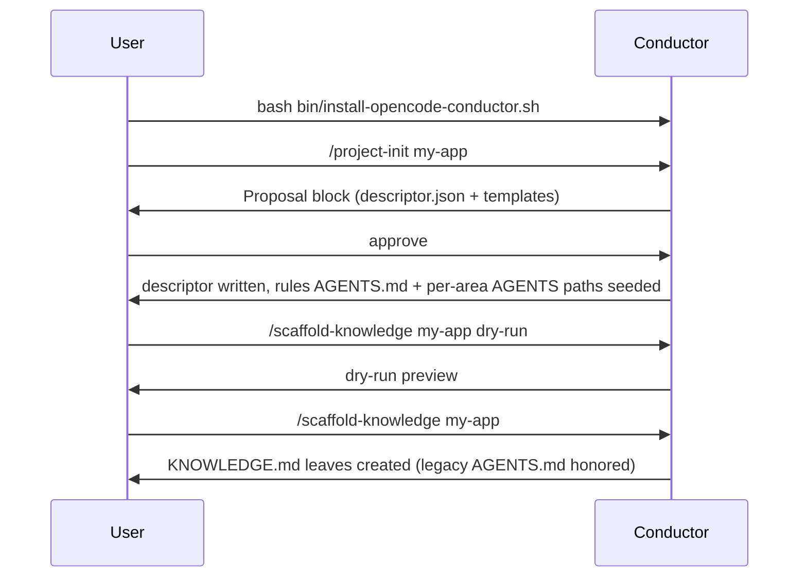
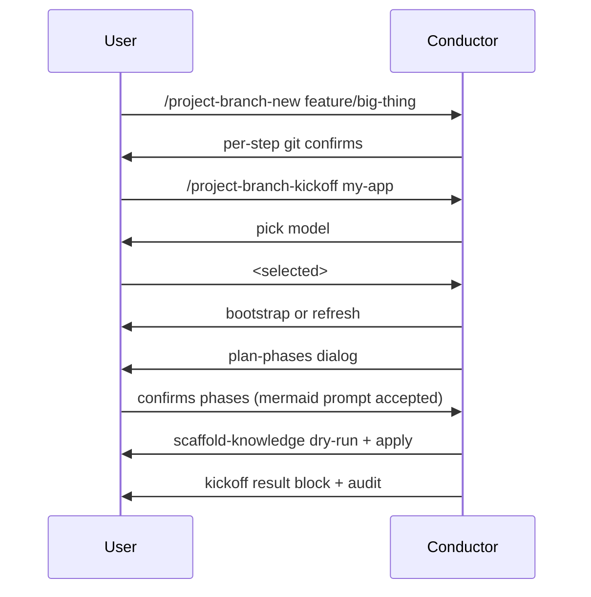
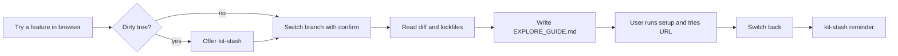
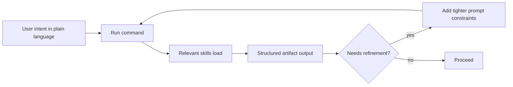

# Workflow Scenarios

This page is a tutorial walkthrough of the canonical scenarios. The contract source — short, normative, agent-facing — is `documentation/WORKFLOW.md`.

## Scenario A — First time on a project



What you'll see at the end:

```markdown
## Scaffold result
- created: <n> leaf KNOWLEDGE.md (+ area AGENTS.md merges)
- skipped: 1 (source_missing: legacy/x)
- next_step: customize each leaf as needed
```

## Scenario B — Daily session start

1. Run `/project-refresh <key>`.
2. If you see `missing_branch_context`, run `/project-bootstrap <key>` and rerun refresh.
3. Inspect `## Handoff refresh result` for drift, mode, and next step.

## Scenario C — Big project on a fresh branch



## Scenario D — Tracked-loop iteration

After implementing some changes, run `/project-checkpoint <key>` to record progress in `LOG.md`. When you're ready for review, run `/project-review <key>` and `/project-update-mr <key>`.

## Scenario E — Lite mode (no descriptor, no MR)

For lightweight throwaway work, you can skip descriptor and MR entirely. Use the verification helpers (`/check-types`, `/run-tests`, `/lint-fix`) directly. The kit will not write durable knowledge in this mode.

## Scenario F — Branch exploration



## Scenario G — Help docs generation

1. Decide `<output-root>` outside the repo.
2. Run `/project-help-docs <output-root> --scope=<area>`.
3. Review the audit findings (none expected if vocab is clean).
4. Publish from `<output-root>` to your docs site.

## Scenario H — Cross-branch master drift

Your branch is behind `main`. The kit:

- Surfaces a knowledge-drift finding via the preflight.
- Suggests a single-file pull-up for stale durable knowledge files (leaf `KNOWLEDGE.md` / legacy `AGENTS.md`, and area docs per descriptor).
- Does not auto-rebase; you control the merge strategy.

## Scenario I — Combining prompts with commands and skills

You can combine a short prompt with a command to shape output without losing deterministic behavior.



Recommended pattern:

1. State constraints in one sentence.
2. Execute the owning command.
3. Refine with a second prompt only if needed.

Examples:

- "Think like a senior architect; optimize for low operational risk." + `/project-branch-kickoff my-app`
- "Review for correctness + security; avoid noisy style findings." + `/project-review my-app`
- "Draft docs for support staff; exclude internal-only terms." + `/project-help-docs ~/tmp/help --scope=commands`

### Plan vs Build in real sessions

- Use **Plan mode** for discovery, architecture, roadmap, risk analysis, and review framing.
- Switch to **Build mode** when the task is implementation-ready.
- Commands/skills can suggest mode switches; users should confirm before switching.

## What a real session looks like

```markdown
> /project-branch-kickoff my-app

## Branch kickoff result
- model: <selected>
- mode: tracked
- phases: 4
- mermaid: yes
- scaffold: applied (3 leaves)
- audit: appended

> /project-checkpoint my-app

## Checkpoint result
- snippet appended to LOG.md

> /project-review my-app

## Preflight summary
- drift: clean
- missing-block: none

## Findings
| id | severity | scope | summary |
| --- | --- | --- | --- |
| F-01 | info | api | unused import |

## Suggested verifications
- bun run typecheck
- bun run test
- pytest api -v
```
